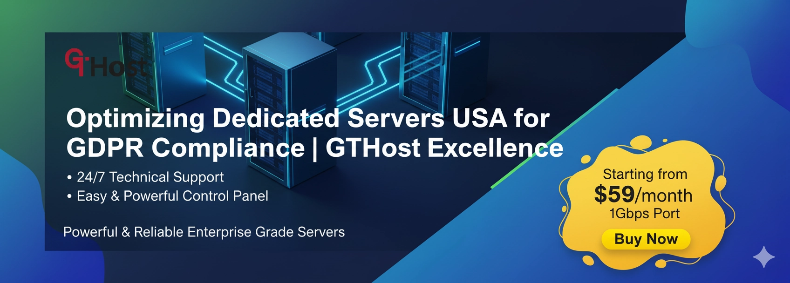

# Optimizing USA Dedicated Servers for GDPR Compliance Without the Headache

You know that sinking feeling when your online store starts lagging during checkout? Customers clicking away, carts abandoned, support tickets piling up. Then—just when you think it can't get worse—a privacy regulator sends a notice about your data handling. Welcome to every business owner's nightmare: performance problems meeting compliance chaos.

Here's the thing nobody tells you: reliable hosting isn't some luxury upgrade anymore. It's the foundation everything else sits on. And if you're dealing with customers in both the US and Europe, you need servers that can handle serious traffic *and* keep regulators happy. This guide shows you how USA dedicated servers—particularly the instant-deploy, actually-monitored kind—solve both problems at once.

---

## What Makes Dedicated Servers Different (And Why You Might Actually Need One)

A dedicated server is basically a physical machine that's all yours. No sharing CPU cycles with someone's hobby blog or RAM with a crypto miner.

Unlike shared hosting (where you're one of hundreds crammed onto the same box) or VPS hosting (which at least gives you a virtual slice), dedicated means the entire server—processor, memory, storage, network—belongs to you. You get root access. You configure everything. Nobody else's traffic spike crashes your site.

**The hardware situation:**
- CPU: Modern multi-core processors (Xeon, EPYC, whatever makes sense for your workload)
- RAM: 32GB to 512GB+, depending on what you're running
- Storage: NVMe SSDs for speed, sometimes RAID for redundancy
- Network: Dedicated bandwidth allocation, often unmetered

**Who actually needs this:**
If you're running high-traffic e-commerce, game servers, streaming platforms, big databases, AI workloads, or anything where "it'll probably be fine" isn't good enough—dedicated servers make sense. They're predictable. When your app needs 16 cores and 128GB RAM right now, it gets them. No surprises.

## Why USA Location Actually Matters (Beyond Just Geography)

**The latency thing:**
If most of your customers are in North America, hosting in Ashburn or Los Angeles means faster load times. Simple physics—closer servers, quicker responses. Content delivery networks help, but that origin server location still matters for anything dynamic.

**The legal angle:**
GDPR applies to you if you're processing EU citizens' data, regardless of where your servers sit. But here's the catch: having infrastructure in a jurisdiction with strong data protection practices (and clear legal frameworks) makes compliance easier. Some US states have privacy laws that complement GDPR. A provider with robust security practices helps you tick multiple regulatory boxes at once.

**The performance reality:**
USA data centers often have excellent international peering. Even European or Asian users can get good speeds when paired with proper CDNs and caching. For latency-sensitive stuff—gaming, fintech, real-time applications—every millisecond counts.

GTHost operates in ten USA locations: Atlanta, Ashburn, Chicago, Dallas, Denver, Los Angeles, Miami, New York, Santa Clara, Seattle. Pick whichever is closest to your users. Each facility has redundant power, networking, physical security, the works.

**Industries that benefit:**
- Finance/fintech: Need audit trails, encryption, access controls
- Gaming/streaming: High bandwidth, low latency, stability during traffic spikes
- E-commerce: GDPR compliance for EU customers, secure payments, fast checkouts
- AI/ML/Big Data: High throughput, large storage, sometimes GPU access

## Real-Time Monitoring: The Thing That Actually Prevents Disasters

Most hosting monitoring is reactive. Something breaks, an alert fires, someone eventually responds. Real-time monitoring is different—it catches problems *before* they escalate.

**What gets tracked:**
CPU load, RAM usage, disk I/O, network bandwidth, packet loss, latency, security events (login attempts, intrusion patterns), disk health (SMART status), temperature, power issues. All the stuff that can go wrong.

**GTHost's approach:**
They run a Looking Glass portal where you can see live metrics. But more importantly, their system sends instant alerts when thresholds breach—CPU above 90%, traffic anomalies, possible DDoS activity. Security threats get flagged immediately.

**Why this matters:**
Most providers offer basic periodic checks. Issues can snowball before anyone notices. With proper monitoring, 👉 [GTHost maintains 99.99% uptime](https://cp.gthost.com/en/join/72c7e6b2fc118929f9ede2978f008806) because problems get caught early. A sudden spike in disk I/O might signal impending drive failure—catch it early, replace the drive, avoid downtime.

**Real scenarios:**
- E-commerce store expecting Black Friday traffic: monitoring reveals CPU/network spikes ahead of time, capacity gets scaled before the crash happens
- Unusual login attempts trigger alerts: firewall rules applied, brute force attack thwarted before damage occurs

## Proactive Support: When Your Host Actually Prevents Problems

There are two kinds of support. Reactive support waits for things to break, then scrambles to fix them. Proactive support anticipates issues and handles them before you notice.

**What proactive actually means:**
Watching for hardware wear, capacity limits approaching, security vulnerabilities emerging. Implementing fixes or sending alerts before customers experience problems. It's the difference between "sorry your site was down" and "we upgraded your RAM last night because we saw you were approaching limits."

**GTHost's setup:**
- 24/7 in-house support team (not outsourced)
- Predictive maintenance: replacing failing drives before they fail, updating firmware, patching security holes
- Automated alerts for anomalies: power supply issues, temperature problems, network congestion
- Expert troubleshooting with proactive recommendations (add more RAM, implement caching, adjust firewall settings)

**Examples:**
A gaming platform gets featured on social media. Traffic multiplies. GTHost's monitoring catches the incoming bandwidth surge, alerts you before limits hit, you upgrade or distribute traffic—crash avoided.

An SSD shows increasing SMART errors. GTHost notices early, replaces the drive while maintaining RAID mirror—no data loss, no downtime, you probably never even knew it happened.

## Key Features That Actually Matter

**Hardware and instant setup:**
GTHost deploys servers in 5-15 minutes after purchase. Hardware pre-provisioned, networking configured, OS installed. No waiting days for someone to rack a server.

High-end CPUs (Xeon/EPYC), large RAM configurations, NVMe/SSD storage. RAID where it makes sense.

**Bandwidth without surprises:**
Unmetered bandwidth on most plans. No overage charges, consistent throughput. Matters for streaming, backups, large file transfers, or when traffic suddenly spikes.

**No hidden fees:**
No setup fees. Transparent pricing. Some plans include trial periods or money-back guarantees—test performance without long-term commitment.

**Security, DDoS protection, scalability:**
Built-in firewall options, DDoS mitigation, secure network layers. When you need to scale, you can adjust resources, add IP addresses, increase bandwidth, or migrate to different USA locations.

**Quick comparison:**

| Tier | CPU/RAM/Storage | Bandwidth | Locations | Cost |
|------|----------------|-----------|-----------|------|
| Entry | 8-16 cores / 32-64GB / 1-2TB NVMe | Unmetered (1-10 Gbps) | Ashburn, Chicago, Dallas | Mid-range |
| Mid | 16-32 cores / 128-256GB / NVMe + RAID | Unmetered (10-25 Gbps) | Multiple USA locations | Premium |
| High-end | 32+ cores / 512GB+ / NVMe + RAID / GPU optional | Unmetered, high throughput | Many USA locations | Top tier |

Many "cheap" dedicated servers skimp on support or cap bandwidth. GTHost includes unmetered capacity and stronger SLA targets.

## Choosing the Right Provider: What Actually Matters

| Criteria | Why It Matters | GTHost's Offering |
|----------|---------------|-------------------|
| Uptime | Downtime costs money and reputation | 99.99%+ uptime, real-time monitoring, proactive maintenance |
| Support | Issues happen at 3 AM | 24/7 in-house expert support, not outsourced |
| Security/Compliance | GDPR, data privacy, auditability | DDoS protection, secure servers, access controls, logs |
| Setup Speed | Fast deployment saves time | 5-15 minute deployment, minimal setup fees |
| Cost vs Value | Hidden fees hurt | Transparent pricing, no setup fees, strong features |

## Real-World Applications (Anonymized But Real Problems)

**E-commerce store:**
Midsize fashion retailer with US and EU customers. Hosted on shared/VPS. During holidays, checkout delays caused 25% cart abandonment. GDPR concerns with data spread across jurisdictions. Migrated to GTHost dedicated server in Ashburn with unmetered bandwidth and monitoring. Load times improved 40%, cart abandonment dropped to 5%. Data consolidated, privacy policies updated, auditors satisfied.

**SaaS analytics platform:**
Tech firm offering dashboards to US/EU clients. Traffic spiked during marketing campaigns, causing RAM/CPU saturation on VPS. Switched to high-end GTHost dedicated server in Chicago. Proactive support flagged capacity issues before launch. RAM upgraded. Zero downtime during campaign, GDPR audit passed thanks to secure logs and data control.

**Video streaming platform:**
Sports streaming service needed low latency in USA and GDPR compliance for EU viewers. Used GTHost dedicated servers in Los Angeles and Miami for USA traffic, paired with CDN for international. Real-time monitoring caught DDoS attempts, mitigation preserved streams. Data retention and privacy policies aligned with GDPR. Subscriber churn reduced.

## Common Questions, Straight Answers

**What is real-time monitoring in dedicated servers?**
Constant tracking of server metrics—CPU, RAM, bandwidth, security threats. GTHost's Looking Glass portal provides early alerts to prevent issues proactively.

**Why choose dedicated servers over shared or VPS?**
Exclusive hardware, full control, higher performance. GTHost offers instant setup with dedicated resources for demanding workloads and compliance needs.

**How does server location affect GDPR compliance?**
GDPR applies globally, but data stored in compliant US centers with strong policies (access control, encryption) helps satisfy EU data subject rights. GTHost provides that infrastructure.

**What is proactive support?**
Support that anticipates problems before impact. GTHost's team predicts hardware failures, scales resources, patches issues proactively.

**How fast can I get a server with GTHost?**
About 5-15 minutes post-order, with full OS setup and network ready.

**What is unmetered bandwidth?**
Unlimited data transfer without overage penalties. GTHost includes this so you can scale traffic without surprise charges.

**Which USA locations does GTHost offer?**
Atlanta, Ashburn, Chicago, Dallas, Denver, Los Angeles, Miami, New York, Santa Clara, Seattle—multiple data centers for geographic, legal, and latency flexibility.

**How do I ensure security and GDPR compliance?**
Use server encryption, secure log access, DDoS protection, privacy policies, periodic audits. GTHost offers built-in DDoS tools, firewalls, access control.

**What uptime can I expect?**
With real-time monitoring and proactive support, GTHost maintains 99.99%+ uptime, significantly reducing outages and downtime costs.

**How do I scale if traffic spikes?**
Upgrade RAM, CPU, bandwidth. With proactive support, GTHost alerts you in advance for seamless scaling.

**Can I get compliance documentation for audits?**
Yes. GTHost maintains logs, security policies, access controls, and standard compliance documentation for GDPR or similar requirements.

**What distinguishes GTHost from cheap providers?**
Cheap providers often cut corners on uptime, support, security. GTHost delivers instant setup, unmetered bandwidth, solid 24/7 support.

---

## The Bottom Line

Here's what matters: reliable hosting that handles both performance demands and regulatory requirements isn't optional anymore. A business that fails due to slow speeds, frequent downtime, or GDPR non-compliance risks financial penalties and customer trust.

GTHost's USA dedicated servers deliver what modern businesses actually need: bare-metal performance, instant deployment (5-15 minutes), unmetered bandwidth, multiple USA locations, robust real-time monitoring through the Looking Glass portal, and 24/7 in-house proactive support. You get performance, security, scalability, and regulatory alignment in one package.

If you're looking for hosting that handles high-traffic demands, protects user data, and maintains uptime under pressure, 👉 [GTHost's dedicated USA servers solve real problems without the usual hosting headaches](https://cp.gthost.com/en/join/72c7e6b2fc118929f9ede2978f008806). The infrastructure works. The support actually responds. The compliance features exist. Try it and see the difference for yourself.
